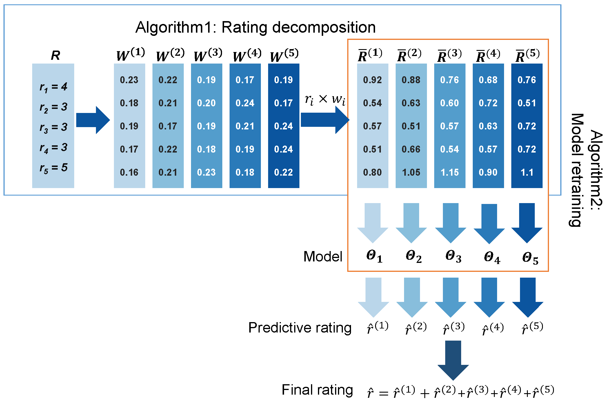

Understanding user preference is essential to the optimization of recommender systems. As a feedback of user’s taste, the rating score can directly reflect the preference of a given user to a given product. Uncovering the latent components of user ratings is thus of significant importance for learning user interests. In this paper, a new recommendation approach was proposed by investigating the latent components of user ratings. The basic idea is to decompose an existing rating into several components via a cost-sensitive learning strategy. Specifically, each rating is assigned to several latent factor models and each model is updated according to its predictive errors. Afterward, these accumulated predictive errors of models are utilized to decompose a rating into several components, each of which is treated as an independent part to further retrain the latent factor models. Finally, all latent factor models are combined linearly to estimate predictive ratings for users. In contrast to existing methods, our method provides an intuitive preference modeling strategy via multiple component analysis at an individual perspective. Meanwhile, it is verified by the experimental results on several benchmark datasets that the proposed method is superior to the state-ofthe-art methods in terms of recommendation accuracy.

Firstly, the gradient descent method is utilized to compute the weights of latent models with respect to those five ratings, namely $ W^{(1)}, W^{(2)},...,W^{(5)} $ in Fig. 1. Secondly, the weights of latent models are exploited to decompose each rating into five latent components. For instance, the rating $ r_1 = 4 $ is decomposed into 0.92, 0.88, 0.76, 0.68 and 0.76. Thirdly, each group of the latent component is chosen to retrain the previous learned models. 

[Download paper here](../files/2018Preference.pdf)
